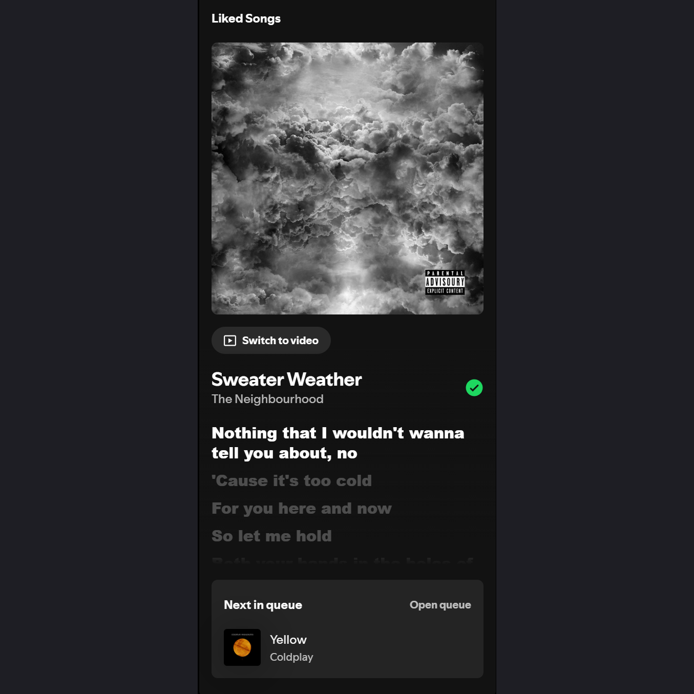

# Sidebar Lyrics for Spicetify

Synchronized lyrics rendered seamlessly inside Spotify's Right Sidebar (**Now Playing View**).



## Overview & Features

- **Clean Sidebar Layout**: Hides unnecessary default sidebar clutter (Artist Card, Song Credits, Merch, Tour Dates, etc.), leaving only the current track info, lyrics, and Next in Queue.
- **Synchronized Lyrics**: Integrates with the free LRCLIB API to display real-time synced lyrics.
- **Smart Queue Prefetching**: Automatically prefetches lyrics for the upcoming track in your queue for instantaneous updates on song changes.
- **Smooth 0% CPU Scrolling**: Uses hardware-accelerated 3D CSS transforms (`translate3d`) and opacity transitions for smooth scrolling without performance degradation.

## Installation

1. Copy `sidebar-lyrics.js` into your Spicetify extensions folder.
2. Enable and apply the extension via Spicetify CLI:
   ```bash
   spicetify config extensions sidebar-lyrics.js
   spicetify apply
   ```
